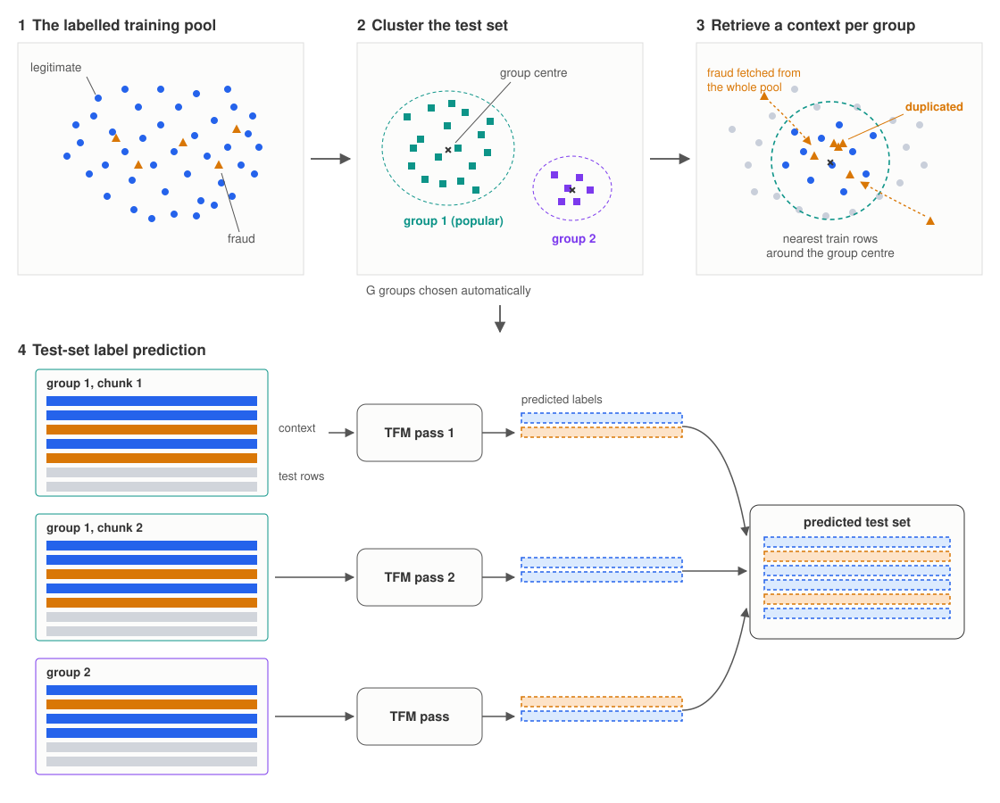

```{=html}
<style>
.reveal table { font-size: 0.62em; }
.reveal .slides { font-size: 0.82em; }
.reveal h2 { font-size: 1.35em; }
.reveal .small { font-size: 0.75em; }
#refs { font-size: 0.55em; }
</style>
```

```{r}
#| label: setup
#| include: false
library(dplyr)
library(ggplot2)
library(scales)
library(ggpattern)
library(gt)

formal_datasets <- c("eu_cc", "banksim", "paysim", "fifar", "baf")
gbdt_models <- c("xgboost", "catboost")
keep_cols <- c("dataset", "model", "condition", "seed", "pipeline_version",
               "n_estimators", "pr_auc", "recall_at_1fpr", "recall_at_5fpr",
               "roc_auc", "fraud_ratio", "n_train", "n_fraud_train",
               "context_size", "context_fraud_n")
runs <- list.files("results/runs", pattern = "\\.parquet$", full.names = TRUE) |>
  lapply(\(f) { d <- nanoparquet::read_parquet(f)
                d[, intersect(keep_cols, names(d)), drop = FALSE] }) |>
  bind_rows()
v4 <- runs |> filter(pipeline_version == 4, dataset %in% formal_datasets)
c1 <- v4 |> filter(condition == "C1")

## RQ1 family means (per-model means first, as in the thesis)
fam_means <- c1 |>
  mutate(family = if_else(model %in% gbdt_models, "GBDT", "TFM")) |>
  group_by(family, dataset, model) |>
  summarise(pr = mean(pr_auc), .groups = "drop_last") |>
  summarise(pr = mean(pr), .groups = "drop_last") |>
  summarise(pr = mean(pr), .groups = "drop_last") |>
  bind_rows(c1 |>
    filter(model %in% c("tabiclv2", "tabpfn_3")) |>
    mutate(family = "SOTA TFM") |>
    group_by(family, dataset, model) |>
    summarise(pr = mean(pr_auc), .groups = "drop_last") |>
    summarise(pr = mean(pr), .groups = "drop_last") |>
    summarise(pr = mean(pr), .groups = "drop_last"))
fam_of <- \(f) sprintf("%.3f", fam_means$pr[fam_means$family == f])

## RQ2 paired C1-to-C2 deltas
paired <- v4 |>
  filter(condition %in% c("C1", "C2"), !model %in% gbdt_models) |>
  select(dataset, model, seed, condition, pr_auc) |>
  tidyr::pivot_wider(names_from = condition, values_from = pr_auc) |>
  filter(!is.na(C1), !is.na(C2)) |>
  mutate(delta = C2 - C1)
gain_by_model <- paired |> group_by(model) |> summarise(d = mean(delta))
gain_of <- \(m) sprintf("%+.3f", gain_by_model$d[gain_by_model$model == m])
canon <- paired |> filter(dataset == "paysim", model == "tabpfn_v2") |>
  summarise(C1 = mean(C1), C2 = mean(C2))
canon_fr <- v4 |>
  filter(dataset == "paysim", model == "tabpfn_v2",
         condition %in% c("C1", "C2")) |>
  group_by(condition) |>
  summarise(fr = mean(context_fraud_n), .groups = "drop")
canon_fr_of <- \(cond) comma(round(canon_fr$fr[canon_fr$condition == cond]))
c1_share <- c1 |> filter(!model %in% gbdt_models) |>
  summarise(s = mean(context_fraud_n / context_size)) |> pull(s)

## C2 ratio sweep (50k context) and XGBoost reference
c2grid <- list.files("results/runs_c2grid", pattern = "\\.parquet$",
                     full.names = TRUE) |>
  lapply(nanoparquet::read_parquet) |>
  bind_rows()
sweep_datasets <- c("eu_cc", "banksim", "paysim")
sweep_labels <- c("EU CC", "BankSim", "PaySim")
rq2_summ <- c2grid |>
  filter(context_size_req == 50000, dataset %in% sweep_datasets) |>
  group_by(dataset, model, fraud_ratio) |>
  summarise(mean_pr = mean(pr_auc), sd_pr = sd(pr_auc), .groups = "drop") |>
  mutate(model = factor(model, c("tabpfn_3", "tabiclv2"),
                        c("TabPFN v3", "TabICLv2")),
         dataset = factor(dataset, sweep_datasets, sweep_labels))
xgb_ref <- c1 |>
  filter(model == "xgboost", dataset %in% sweep_datasets) |>
  group_by(dataset) |>
  summarise(pr = mean(pr_auc), .groups = "drop") |>
  mutate(dataset = factor(dataset, sweep_datasets, sweep_labels))

## RQ3: C3 vs C1 on matched seeds
rq3_md_lv <- c("tabpfn_3", "tabiclv2")
rq3_cmp <- v4 |>
  filter(n_estimators == 4, model %in% rq3_md_lv,
         condition %in% c("C1", "C3"))
rq3_c3 <- rq3_cmp |> filter(condition == "C3")
rq3_pairs <- rq3_cmp |>
  semi_join(distinct(rq3_c3, dataset, model, seed),
            by = c("dataset", "model", "seed")) |>
  select(dataset, model, seed, condition, pr_auc) |>
  tidyr::pivot_wider(names_from = condition, values_from = pr_auc) |>
  mutate(delta = C3 - C1)
rq3_delta <- rq3_pairs |>
  group_by(dataset, model) |>
  summarise(d = mean(delta), .groups = "drop")
rq3_d_of <- \(ds, m, dg = 2) sprintf(paste0("%+.", dg, "f"),
  rq3_delta$d[rq3_delta$dataset == ds & rq3_delta$model == m])
rq3_c3_of <- \(ds, f) sprintf("%.2f", f(rq3_c3$pr_auc[rq3_c3$dataset == ds]))

## relevance ablation, 2x2 at G = 32 and enforced ratios 5/10 %
abl <- list.files("results/runs_ablation", pattern = "\\.parquet$",
                  full.names = TRUE) |>
  lapply(nanoparquet::read_parquet) |>
  bind_rows() |>
  filter(G == 32, fraud_ratio %in% c(0.05, 0.10),
         ratio_spec %in% c("0.05", "0.1") | is.na(ratio_spec)) |>
  group_by(dataset, arm) |>
  summarise(pr = mean(pr_auc), .groups = "drop")
abl_of <- \(ds, a) sprintf("%.3f", abl$pr[abl$dataset == ds & abl$arm == a])

## RQ4 seed-matched condition pivot
rq4_all <- v4 |>
  filter(n_estimators == 4, model %in% rq3_md_lv)
rq4_cmp <- rq4_all |>
  semi_join(rq4_all |> filter(condition == "C4") |> distinct(dataset, seed),
            by = c("dataset", "seed"))
rq4_base <- rq4_cmp |> filter(condition %in% c("C1", "C2", "C3")) |>
  group_by(dataset, condition, model) |>
  summarise(pr = mean(pr_auc), .groups = "drop") |>
  group_by(dataset, condition) |>
  summarise(pr = max(pr), .groups = "drop")
rq4_c4b <- rq4_cmp |> filter(condition == "C4") |>
  group_by(dataset, model, fraud_ratio) |>
  summarise(pr = mean(pr_auc), .groups = "drop") |>
  group_by(dataset) |>
  summarise(pr = max(pr), .groups = "drop") |>
  mutate(condition = "C4best")
rq4_piv <- bind_rows(rq4_base, rq4_c4b) |>
  tidyr::pivot_wider(names_from = condition, values_from = pr) |>
  mutate(top = pmax(C1, C2, C3, C4best),
         winner = case_when(top == C2 ~ "C2", top == C1 ~ "C1",
                            top == C3 ~ "C3", TRUE ~ "C4"),
         best = if_else(winner %in% c("C1", "C2") & abs(C2 - C1) < 0.005,
                        "C2 ≈ C1", winner),
         dataset = factor(dataset, formal_datasets,
                          c("EU CC", "BankSim", "PaySim", "FiFAR", "BAF"))) |>
  arrange(dataset)
rq4_fmt <- \(x) ifelse(x < 0.095, sprintf("%.3f", x), sprintf("%.2f", x))
rq4_piv_of <- \(ds, col) rq4_fmt(rq4_piv[[col]][rq4_piv$dataset == ds])
rq4_def_of <- \(ds) rq4_fmt(rq4_piv$C2[rq4_piv$dataset == ds] -
                            rq4_piv$C4best[rq4_piv$dataset == ds])

## SOTA comparison: C2 grid slice + eu_cc full-context CV study
sota_grid <- v4 |> filter(n_estimators == 4 | is.na(n_estimators))
sota_lab <- c(tabpfn_3 = "TabPFN v3", tabiclv2 = "TabICLv2")
sota_c2 <- sota_grid |>
  filter(condition == "C2", model %in% names(sota_lab)) |>
  group_by(dataset, model) |>
  summarise(pr = mean(pr_auc), r5 = mean(recall_at_5fpr), .groups = "drop")
sota_best_pr <- sota_c2 |> group_by(dataset) |>
  slice_max(pr, n = 1, with_ties = FALSE) |> ungroup()
sota_best_r5 <- sota_c2 |> group_by(dataset) |>
  slice_max(r5, n = 1, with_ties = FALSE) |> ungroup()
fmt3 <- \(x) sprintf("%.3f", x)
sota_pr_of  <- \(ds) fmt3(sota_best_pr$pr[sota_best_pr$dataset == ds])
sota_prm_of <- \(ds) sota_lab[sota_best_pr$model[sota_best_pr$dataset == ds]]
sota_r5_of  <- \(ds) fmt3(sota_best_r5$r5[sota_best_r5$dataset == ds])

sota_cv <- list.files("results/runs_sota_cv", pattern = "\\.parquet$",
                      full.names = TRUE) |>
  lapply(nanoparquet::read_parquet) |> bind_rows()
sota_cv_sum <- sota_cv |> group_by(model, arm) |>
  summarise(folds = n(), n_splits = first(n_splits), .groups = "drop")
sota_ctx <- scales::comma(round(mean(sota_cv$context_size)))

sota_ap <- function(y, s) {
  o <- order(s, decreasing = TRUE); y <- y[o]; s <- s[o]
  g <- cumsum(!duplicated(s)); tp <- cumsum(y); nn <- seq_along(y)
  last <- !duplicated(g, fromLast = TRUE)
  prec <- tp[last] / nn[last]; rec <- tp[last] / sum(y)
  sum(diff(c(0, rec)) * prec)
}
sota_cv_complete <- sota_cv_sum |>
  filter(arm == "natural", folds == n_splits) |> pull(model)
sota_pool <- lapply(sota_cv_complete, \(m) {
  ids <- sort(sota_cv |> filter(model == m, arm == "natural") |> pull(run_id))
  cache_dir <- "results/runs_sota_cv/pooled_cache"
  dir.create(cache_dir, showWarnings = FALSE)
  cache_f <- file.path(cache_dir, paste0(
    m, "_", substr(rlang::hash(list(ids, 1000, 42, "v2")), 1, 12), ".rds"))
  if (file.exists(cache_f)) return(readRDS(cache_f))
  p <- bind_rows(lapply(
    file.path("results/runs_sota_cv/preds", paste0(ids, ".parquet")),
    nanoparquet::read_parquet))
  y <- p$y_true; s <- p$prob
  ip <- which(y == 1); ineg <- which(y == 0)
  set.seed(42)
  bs <- replicate(1000, {
    i <- c(sample(ip, replace = TRUE), sample(ineg, replace = TRUE))
    sota_ap(y[i], s[i]) })
  r_at <- \(t) {
    o <- order(s, decreasing = TRUE); yy <- y[o]
    fp <- cumsum(1 - yy); tp <- cumsum(yy)
    max(c(0, (tp / sum(yy))[fp / sum(1 - yy) <= t])) }
  res <- tibble(model = m, n_fraud = sum(y), ap = sota_ap(y, s),
                lo = quantile(bs, 0.025), hi = quantile(bs, 0.975),
                r1 = r_at(0.01), r5 = r_at(0.05),
                roc = (mean(rank(s)[y == 1]) - (sum(y) + 1) / 2) / sum(1 - y))
  saveRDS(res, cache_f)
  res
}) |> bind_rows()
sota_pool_of <- \(m, col) fmt3(sota_pool[[col]][sota_pool$model == m])

ext_eucc <- 0.871
ext_eucc_xgb <- 0.867
stopifnot(sota_best_pr$pr[sota_best_pr$dataset == "banksim"] > 0.772)
stopifnot(sota_pool$lo[sota_pool$model == "tabpfn_3"] < ext_eucc,
          ext_eucc < sota_pool$hi[sota_pool$model == "tabpfn_3"])
```

## Fraud detection is an extreme imbalance problem

- Fraudulent payment transactions in the EEA totalled 4.2 billion Euros in 2024, up 17 % from year before [@ebaecb2025_payment_fraud_report].
- Fraud rates by value sit between 0.001 % and 0.033 % in differen payment instruments. 
  - The publicly available benchmark datasets used here are already heavily oversampled relative to production.
- Evaluation must concentrate on the minority class performance
  - Main evaluation metrics used in this thesis are PR-AUC and recall at fixed FPR.
  - Full dataset accuracy is meaningless at this scale of class imbalance.

## Wasting the context window

Naïve strategy would be to use a uniform random subsample. When the dataset is too large to fit in one pass.

- Number of expected fraud rows in a context size $B$ with prevalence $\pi$ is $\pi B$.
- EU credit-card data, $\pi = 0.17\ \%$, $B = 10\text{" "}000$: about 17 fraud rows.
- At production prevalences woudl be even worse

A randomly chosen  context has two deficiencies:

1. **Irrelevance** Most slots go to rows that say little about the transactions being scored.
2. **Class imbalance** The few fraud rows are too small a sample to characterise fraud from.

## Proposed method: Retrieval-Augmented Prediction (RAP)

{fig-align="center" width="100%"}

## Two levers

- **relevance** kNN retrieval of similar training rows
- **class balance** fraud share raised by oversampling

Experimental conditions to test levers:

| ID | Context construction | Fraud ratio |
|:--|:--|:--|
| C1 | Random subsample | Natural |
| C2 | Stratified random subsample | Balanced (Sweep up to 50/50) |
| C3 | kNN retrieval per test cluster | Natural |
| C4 | kNN retrieval, full RAP | Enforced, swept 5 to 50 % |

## Research questions

- **RQ1.** How TFMs perform  against GBDTs under random subsample?
- **RQ2.** Does controlling the fraud ratio help (C2 vs C1), and is there an optimal ratio?
- **RQ3.** Does a retrieved, relevant context help (C3 vs C1)?
- **RQ4.** Does combining the levers add anything (C4 vs other)?

## Experimental setup

:::: {.columns}

::: {.column width="52%"}
**Models (tested frozen, no finetuning)**

- TabPFN v2/ 2.5 / 2.6 / v3 and TabICLv2 
- Baselines: XGBoost, CatBoost with strong fixed defaults
:::

::: {.column width="48%"}
**Datasets (fraud rate)**

- EU CC 285k rows (0.17 %)
- BankSim 595k (1.2 %), customer-grouped split
- PaySim 6.3M (0.13 %)
- FiFAR 603k (1.2 %), canonical split from literature 
- BAF 1M (1.1 %)
:::

::::

Test ran with seeded stratified 80/20 splits. Evaluated on prevalence-corrected PR-AUC, recall at 1 % and 5 % FPR.

## RQ1: random-context TFMs vs full-data GBDTs

```{r}
#| label: fig-rq1
#| fig-width: 10
#| fig-height: 4.4
c1_summ <- c1 |>
  group_by(dataset, model) |>
  summarise(mean_pr = mean(pr_auc), sd_pr = sd(pr_auc), .groups = "drop") |>
  mutate(
    family = if_else(model %in% gbdt_models, "GBDT", "TFM"),
    model = factor(
      model,
      c("xgboost", "catboost", "tabpfn_v2", "tabpfn_25",
        "tabpfn_26", "tabpfn_3", "tabiclv2"),
      c("XGBoost", "CatBoost", "TabPFN v2", "TabPFN 2.5",
        "TabPFN 2.6", "TabPFN v3", "TabICLv2")
    ),
    dataset = factor(dataset, formal_datasets,
                     c("EU CC", "BankSim", "PaySim", "FiFAR", "BAF"))
  )

ggplot(c1_summ, aes(dataset, mean_pr, fill = model)) +
  geom_col_pattern(
    aes(pattern = family),
    position = position_dodge2(padding = 0.15), width = 0.85,
    colour = "grey25", linewidth = 0.15,
    pattern_colour = NA, pattern_fill = "white",
    pattern_angle = 45, pattern_density = 0.25, pattern_spacing = 0.02,
    pattern_key_scale_factor = 0.6
  ) +
  geom_errorbar(aes(ymin = mean_pr, ymax = mean_pr + sd_pr),
                position = position_dodge2(padding = 0.15),
                width = 0.85, linewidth = 0.35, colour = "grey25",
                na.rm = TRUE) +
  scale_fill_manual(
    values = c("#2a78d6", "#008300", "#e87ba4", "#eda100",
               "#1baf7a", "#eb6834", "#4a3aa7"),
    name = NULL
  ) +
  scale_pattern_manual(values = c(GBDT = "stripe", TFM = "none")) +
  scale_y_continuous(limits = c(0, 1.1), expand = expansion(0)) +
  labs(x = NULL, y = "PR-AUC") +
  guides(
    pattern = "none",
    fill = guide_legend(
      nrow = 1,
      override.aes = list(
        pattern = c("stripe", "stripe", "none", "none", "none", "none", "none")
      )
    )
  ) +
  theme_minimal(base_size = 14) +
  theme(
    legend.position = "bottom",
    panel.grid.minor = element_blank(),
    panel.grid.major.x = element_blank(),
    axis.ticks.x = element_blank()
  )
```

Roughly on par despite the asymmetry (GBDTs trained with the full training split, TFMs context window capped at 50k rows). Family means: GBDT `r fam_of("GBDT")`, all TFMs `r fam_of("TFM")`, the two strongest TFMs `r fam_of("SOTA TFM")`. Best-in-family: 2 TFM wins, 1 tie, 2 losses.

## RQ2: ratio control works, everywhere

- Stratified balancing lifts **every model on every dataset**.
- The lift is largest where the window is smallest: `r gain_of("tabpfn_v2")` mean PR-AUC for TabPFN v2 (10k context) 
  - `r gain_of("tabpfn_3")` for TabPFN v3 and 
  - `r gain_of("tabiclv2")` for TabICLv2.
- The gain in performance is measured on ranking metrics so it is genuine discrimination not just recalibration

## RQ2: the optimal ratio is a broad plateau

```{r}
#| label: fig-rq2
#| fig-width: 10.5
#| fig-height: 4.2
ggplot(rq2_summ, aes(fraud_ratio, mean_pr, colour = model, fill = model)) +
  geom_hline(data = xgb_ref, aes(yintercept = pr),
             linetype = "dotted", colour = "grey25") +
  geom_ribbon(aes(ymin = mean_pr - sd_pr, ymax = mean_pr + sd_pr),
              alpha = 0.2, colour = NA) +
  geom_line(linewidth = 0.7) +
  geom_point(size = 1.4) +
  facet_wrap(~ dataset, nrow = 1, scales = "free_y") +
  scale_colour_manual(values = c("TabPFN v3" = "#eb6834",
                                 "TabICLv2" = "#4a3aa7"), name = NULL) +
  scale_fill_manual(values = c("TabPFN v3" = "#eb6834",
                               "TabICLv2" = "#4a3aa7"), name = NULL) +
  scale_x_continuous(breaks = c(0.02, 0.1, 0.2, 0.3, 0.4)) +
  labs(x = "Requested in-context fraud ratio", y = "PR-AUC") +
  theme_minimal(base_size = 14) +
  theme(legend.position = "bottom", panel.grid.minor = element_blank())
```

::: {.small}
The runs have 50 000-row stratified context means over three seeds, bands one standard deviation. Dotted line is a full-data XGBoost. Ratios near 10 % sit close to the peak on every dataset. Past the point where unique fraud rows run out, higher ratios add duplicates and performance declines. For example, EU CC has only about 394 unique training frauds.
:::

## RQ3: retrieval hurts

- Filling the context by kNN retrieval at the natural ratio scores **worse than the random context** on four of five datasets.

- Forcing finer groupings in the design-space sweep recovers part of the loss but asymptotes **below C2**.

- Ablation on different retrieval strategies
  - Swapping the **fraud** selector to kNN is nearly neutral.
  - Swapping the **legitimate** selector to kNN causes the collapse.

## RQ4: the full RAP still loses to balancing

```{r}
#| label: tbl-rq4
rq4_piv |>
  mutate(across(c(C1, C3, C4best), \(x) sprintf("%.3f", x)),
         C2 = sprintf("**%.3f**", C2)) |>
  select(dataset, C1, C2, C3, C4best, best) |>
  gt() |>
  fmt_markdown(columns = C2) |>
  cols_label(dataset = "Dataset", C4best = "C4 (best ratio)",
             best = "Best strategy") |>
  cols_align("left", columns = dataset) |>
  cols_align("right", columns = c(C1, C2, C3, C4best)) |>
  cols_align("center", columns = best) |>
  tab_options(table.font.size = px(24))
```

::: {.small}
Seed-matched PR-AUC, best TFM model. C4 goes ahead of C3, but still loses to C2 everywhere. Even a 720-run design-space sweep (group count, distance metric, ratio) does not rescue it. The best single configuration only ties C2 on EU CC.
:::

## Best case vs published state of the art: EU CC

```{r}
#| label: fig-sota
#| fig-width: 10
#| fig-height: 4.2
sota_lab_map <- c(rf_external = "Random forest", xgboost = "XGBoost",
                  catboost = "CatBoost", tabpfn_v2 = "TabPFN v2",
                  tabpfn_25 = "TabPFN 2.5", tabpfn_26 = "TabPFN 2.6",
                  tabpfn_3 = "TabPFN v3", tabiclv2 = "TabICLv2")
sota_naive <- sota_grid |> filter(dataset == "eu_cc", condition == "C1") |>
  group_by(model) |>
  summarise(value = mean(pr_auc), sd = sd(pr_auc), .groups = "drop") |>
  mutate(layer = "Naive")
sota_opt_cv <- sota_cv |>
  filter(arm == "natural", model %in% sota_cv_complete) |>
  group_by(model) |>
  summarise(value = mean(pr_auc), sd = sd(pr_auc), .groups = "drop")
sota_opt <- sota_grid |>
  filter(dataset == "eu_cc", condition == "C2") |>
  group_by(model) |>
  summarise(value = mean(pr_auc), sd = sd(pr_auc), .groups = "drop") |>
  anti_join(sota_opt_cv, by = "model") |>
  bind_rows(sota_opt_cv) |>
  mutate(layer = "Optimised")
sota_ext <- tibble(model = c("rf_external", "xgboost"),
                   value = c(ext_eucc, ext_eucc_xgb),
                   sd = NA_real_, layer = "Optimised")
sota_fig <- bind_rows(sota_ext, sota_opt, sota_naive) |>
  mutate(family = if_else(model %in% c(gbdt_models, "rf_external"),
                          "Tree", "TFM"),
         layer = factor(layer, c("Naive", "Optimised")))
sota_ord <- sota_fig |> group_by(model) |>
  summarise(top = max(value), .groups = "drop") |>
  arrange(desc(top)) |> pull(model)
sota_fig <- sota_fig |>
  mutate(model_lab = factor(model, sota_ord, sota_lab_map[sota_ord]))
sota_whisk <- sota_fig |> group_by(model_lab) |>
  slice_max(value, n = 1, with_ties = FALSE)

ggplot(sota_fig, aes(model_lab, value, fill = model_lab, alpha = layer)) +
  geom_col_pattern(aes(pattern = family), position = "identity", width = 0.7,
                   colour = "grey25", linewidth = 0.15,
                   pattern_colour = NA, pattern_fill = "white",
                   pattern_angle = 45, pattern_density = 0.25,
                   pattern_spacing = 0.02, pattern_key_scale_factor = 0.6) +
  geom_errorbar(data = sota_whisk, aes(ymin = value, ymax = value + sd),
                width = 0.3, linewidth = 0.35, colour = "grey25",
                alpha = 1, na.rm = TRUE) +
  scale_fill_manual(values = c(
    "Random forest" = "grey55", "XGBoost" = "#2a78d6",
    "CatBoost" = "#008300", "TabPFN v2" = "#e87ba4",
    "TabPFN 2.5" = "#eda100", "TabPFN 2.6" = "#1baf7a",
    "TabPFN v3" = "#eb6834", "TabICLv2" = "#4a3aa7")) +
  scale_alpha_manual(values = c(Naive = 1, Optimised = 0.4), name = NULL) +
  scale_pattern_manual(values = c(Tree = "stripe", TFM = "none")) +
  scale_y_continuous(limits = c(0, 1.02), expand = expansion(0)) +
  labs(x = NULL, y = "PR-AUC") +
  guides(fill = "none", pattern = "none",
         alpha = guide_legend(override.aes = list(fill = "grey35",
                                                  pattern = "none"))) +
  theme_minimal(base_size = 14) +
  theme(legend.position = "bottom", panel.grid.minor = element_blank(),
        panel.grid.major.x = element_blank(), axis.ticks.x = element_blank())
```

::: {.small}
Solid bars are the naive result (random C1 context on TFMs full-data fit for the trees). Light extension are the each model's best optimised result. For the frontier TFMs that is a stratified 5-fold CV over all 284,807 rows with the full training fold of about `r sota_ctx` rows as context. Pooled PR-AUC: TabICLv2 `r sota_pool_of("tabiclv2", "ap")` (95 % CI `r sota_pool_of("tabiclv2", "lo")` to `r sota_pool_of("tabiclv2", "hi")`), TabPFN v3 `r sota_pool_of("tabpfn_3", "ap")` (`r sota_pool_of("tabpfn_3", "lo")` to `r sota_pool_of("tabpfn_3", "hi")`), against the verified external 0.871 (tuned random forest) [@andradearenas2025smote_credit_card_comparison]
:::

## Limitations

- The negative retrieval result is bounded to this experimental desing. 
- Four of five datasets are simulations, likely smoother and more homogeneous than real payment streams. 
  - A 50 000 row random sample may already cover even the finest
- Modest statistical power: three seeds for most experiments, one split for FiFAR 
- GBDT baselines use fixed strong defaults. Tuned comparisons come from the literature.

## Conclusions

- **TFMs reach state of the art** 
- **Ratio control is the lever that works.** 
  - Stratified balancing lifts every model on every dataset. The optimum is a broad plateau near 5 to 10 % fraud. 
  - Include the fraud rows that exist do not chase a target prevalence through heavy duplication.
- **Retrieval is a negative result.** 
  - Retrieved contexts never beat random ones, the damage traces to the retrieved legitimate rows, and full RAP stays below plain balancing everywhere. 


## Future work

- More complex retrieval strategies.
- SMOTE-style minority synthesis instead of with-replacement duplication on fraud-scarce data.
- Same-protocol head-to-head against post-hoc threshold correction.
- Does the verdict hold on real transaction streams?
  - Larger datasets and more heterogenous examples force other context building schemes.

Thank you. Questions?

## References {#refs}
